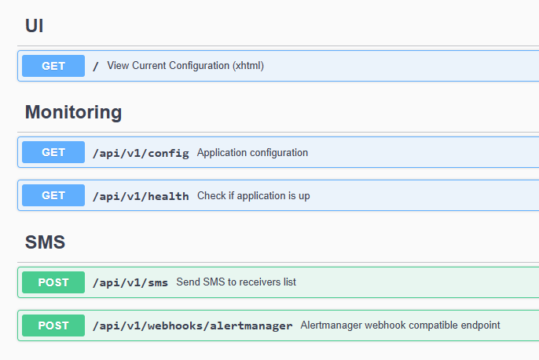

# multisms-api

Wrapper REST API for [Telia Multi SMS](https://www.telia.ee/ari/mobiil/mobiili-lisateenused/multisms) REST API.  



API features:
- Alertmanager webhook compatible endpoint for SMS sending
- SMS receiver groups (whitelisting)
- Rate limiting for API endpoints
- Authentication
- Proxy for Telia API (single whitelisted IP needed)

## Development

> NB! Telia MultiSMS API (https://multisms.telia.ee) has IP whitelisting!

Frameworks used:
- [Flask-OpenAPI3](https://luolingchun.github.io/flask-openapi3/v4.x/) ([github repository](https://github.com/luolingchun/flask-openapi3/tree/master/examples))
- [Flask](https://flask.palletsprojects.com) ([github repository](https://github.com/pallets/flask/))
- [pytest](https://docs.pytest.org/en/stable/) ([github repository](https://github.com/pytest-dev/pytest/))

API docs (auto generated):
- http://127.0.0.1:5000/openapi/swagger
- http://127.0.0.1:5000/openapi/openapi.json

### Local environment setup

#### Specific python version install

Debian/Ubuntu:
```
sudo add-apt-repository ppa:deadsnakes/ppa
sudo apt update 
sudo apt install python3.13 python3.13-venv
```

#### Environment & Packages

Create python venv  
_(if `./src/.venv` does not exist)_
```
cd ./src
python3.13 -m venv .venv
```

Activate venv
```
. .venv/bin/activate
```

Install required packages into venv
```
pip install --upgrade pip
pip install -r requirements.txt
```
> NB! re-run install when `requirements.txt` gets updated!

#### Configuration

Create `./src/.env` file with __required__ environment variables (__local development__):  
```
LOG_LEVEL_APP="INFO"
LOG_LEVEL_HTTP="INFO"
LOG_LEVEL_GUNICORN="INFO"
TELIA_URL="https://multisms.telia.ee"
TELIA_USER=""
TELIA_PW=""
API_BASIC_AUTH_USER="test1"
API_BASIC_AUTH_PW="test1"
SMS_SENDER=""
```
> NB! Use `API_BASIC_AUTH_USER` + `API_BASIC_AUTH_PW` value in Swagger "Authorize".

Create `./src/config/receiver_groups.yaml` with SMS receivers groups (example):
```
receiver_groups:
  - name: test_group1
    description: valid sms senders group
    receivers:
      - 37256000001
      - 37256000002
      - 37256000003
  - name: test_group2
    description: valid sms senders group
    receivers:
      - 37256000010
      - 37256000011
      - 37256000012
```
> PS! All groups use global `SMS_SENDER` number.

## Running app

```
$ flask run
 * Serving Flask app 'webserver'
 * Running on http://127.0.0.1:5000 (Press CTRL+C to quit)
```

## Running tests

```
$ python -m pytest -v --cache-clear

========= test session starts =========
collected 60 items

tests/functional/test_get_groups.py::test_get_groups PASSED
tests/functional/test_get_health.py::test_get_health PASSED
tests/functional/test_post_sms.py::test_post_sms[success_request_1groups] PASSED
tests/functional/test_post_sms.py::test_post_sms[success_request_2groups] PASSED
tests/functional/test_post_sms.py::test_post_sms[partial-success_request_2groups] PASSED
tests/functional/test_post_sms.py::test_post_sms[error_request_1groups] PASSED
tests/functional/test_post_sms_alertmanager.py::test_post_sms[success_request_1groups] PASSED
tests/functional/test_post_sms_alertmanager.py::test_post_sms[success_request_2groups] PASSED
tests/integration/test_alertmanager_url_params.py::test_alertmanager_url_params_missing PASSED
tests/integration/test_alertmanager_url_params.py::test_alertmanager_url_params_unknown PASSED
tests/integration/test_auth_endpoints.py::test_health_endpoint_no_auth PASSED
tests/integration/test_auth_endpoints.py::test_sms_endpoint_no_auth PASSED
...

========= 60 passed in 1.11s ===========
```
> PS. For running only specific tests: `python -m pytest -v --cache-clear -k auth`

## Tests coverage report

```
$ python -m pytest -v --cov --cov-report=term-missing --cov-report=html:htmlcov --cov-report=xml

Name                                               Stmts   Miss  Cover   Missing
--------------------------------------------------------------------------------
app.py                                                52      0   100%
application/auth/basic_auth.py                        12      0   100%
application/core/alert_payload.py                     31      0   100%
application/core/telia_payload.py                     52      0   100%
application/routes/get_config.py                      12      0   100%
application/routes/get_health.py                       8      0   100%
application/routes/post_alertmanager.py               27      0   100%
application/routes/post_sms.py                        20      0   100%
application/schemas/api/api_params.py                  3      0   100%
application/schemas/api/api_post_body.py              33      0   100%
application/schemas/api/api_responses.py              29      0   100%
application/schemas/config/sms_receivers_yaml.py      20      0   100%
application/schemas/services/telia_payload.py         13      0   100%
application/schemas/services/telia_responses.py       29      0   100%
application/services/telia_api.py                     51      0   100%
application/utils/config_helper.py                     7      0   100%
application/utils/exceptions.py                       16      0   100%
application/utils/exceptions_handler.py               23      0   100%
application/utils/log_filters.py                      10      0   100%
application/utils/rate_limiter.py                      4      0   100%
application/utils/util.py                             13      0   100%
config.py                                             36      0   100%
--------------------------------------------------------------------------------
TOTAL                                                501      0   100%

Coverage HTML written to dir htmlcov
Coverage XML written to file coverage.xml
```
> PS. `Missing: 61-71` for example means exact line numbers not hit by tests.

## Sonarqube code analysis

Using [sonar-scanner-cli](https://docs.sonarsource.com/sonarqube-server/latest/analyzing-source-code/scanners/sonarscanner/)
```
cd ./src
sonar-scanner \
  -Dsonar.host.url=${SONAR_HOST_URL} \
  -Dsonar.token=${SONAR_TOKEN} \
  -Dsonar.projectKey=${SONAR_PROJECT_KEY} \
  -Dsonar.projectName=${SONAR_PROJECT_NAME}
```
NB! Run coverage first to create needed `src/coverage.xml`